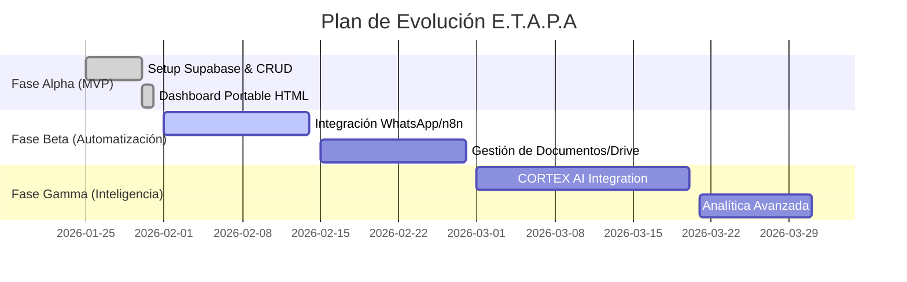

# 🗺️ ROADMAP INTELIGENTE: DASHBOARD E.T.A.P.A (IAmazing)
> **Estado:** Fase Alpha (MVP) Completada
> **Visión:** Convertir el Dashboard en el cerebro autónomo de la agencia en 90 días.

## 🌟 La Estrella del Norte (North Star)
Lograr una producción 100% determinista donde el software gestione el 80% de las tareas operativas, permitiendo que el equipo humano se enfoque exclusivamente en la creatividad de alto nivel.

---

## 🛠️ Matriz de Prioridades (MoSCoW)

### 🔴 MUST: Crítico (Próximos 15 días)
-   **Integración n8n/WhatsApp:** Notificaciones automáticas a clientes cuando un proyecto cambia a "Aprobación".
-   **Gestión de Archivos:** Link directo a carpetas de Google Drive/Dropbox desde la tarjeta del proyecto.
-   **Módulo de Gastos:** Registro de pagos a editores vinculados a proyectos completados.

### 🟡 SHOULD: Importante (Día 30-45)
-   **CORTEX Assistant v2:** Chatbot avanzado con lógica de analítica. :done:
-   **Métricas y Gráficas:** Visualización de rendimiento con Chart.js. :done:
-   **Multi-usuario con Roles:** Login para editores. :done:
-   **Reportes PDF:** Generación automática de reportes de rendimiento mensual para clientes.

### 🟢 COULD: Deseable (Día 60+)
-   **IA Video Preview:** Mini-reproductores dentro del dashboard para revisar ediciones sin salir.
-   **Control de Stock de Contenedores:** Integración con sistemas de almacenamiento físico si aplica.
-   **App Móvil:** Versión PWA para seguimiento desde el celular.

---

## 📅 Cronograma de Ejecución (Visual)

---

## 📈 Indicadores de Progreso (SLA)
-   **Tiempo de Entrega (Lead Time):** Reducir de 48h a 24h promedio.
-   **Tasa de Aprobación (QC):** Mantener >95% en la primera iteración.
-   **Uso de la Herramienta:** 100% de los proyectos registrados en el Dashboard.
