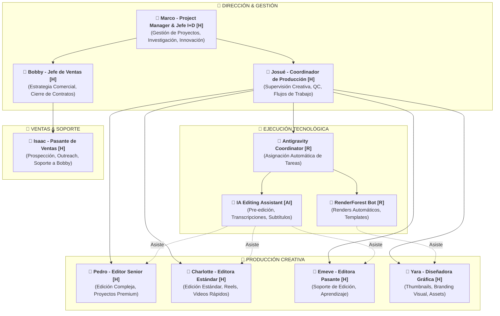
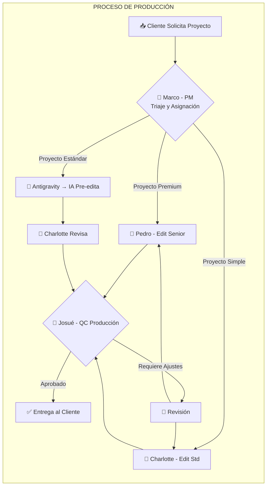

# Organigrama Operativo – IAmazingContent.Space

## Misión y Visión Global

**Misión:** Democratizar la producción de contenido audiovisual premium mediante la combinación de talento humano curado y tecnología IA de vanguardia, permitiendo a creadores y marcas de Hispanoamérica, USA y Brasil competir globalmente.

**Visión:** Ser la plataforma líder de producción de contenido IA-asistida en LATAM, estableciendo el estándar de calidad-precio y transparencia en la industria.

---

## Estructura Organizacional Híbrida (Humano + IA)

### Principios de Diseño
- **Regla 80/20:** 80% ejecución tecnológica, 20% control humano crítico.
- **Jerarquía Minimalista:** Mínima intervención humana necesaria.
- **Flujos Ágiles:** Sincronización mediante triggers tecnológicos, no reuniones.

---

## Organigrama Vertical (Jerarquía de Control)

---

## Matriz de Responsabilidades (RACI)

| Tarea/Proceso | Marco (PM) | Josué (Coord Prod) | Bobby (Ventas) | Pedro (Edit Sr) | Charlotte (Edit Std) | Emeve (Pasante) | Yara (Diseño) | Isaac (Pasante V) | IA/Bots |
|---------------|------------|-------------------|----------------|-----------------|---------------------|-----------------|---------------|-------------------|---------|
| **Gestión de Proyectos** | A | C | C | I | I | I | I | I | R |
| **Estrategia de Negocio** | A | C | C | I | I | I | I | I | - |
| **Supervisión de Calidad (Producción)** | C | A | I | R | R | R | R | I | C |
| **Edición de Video (Compleja)** | I | C | I | A | R | C | I | I | C |
| **Edición de Video (Estándar)** | I | C | I | R | A | R | I | I | R |
| **Edición de Video (Soporte)** | I | C | I | C | C | A | I | I | R |
| **Diseño Gráfico (Thumbnails)** | I | C | I | I | I | C | A | I | C |
| **Pre-edición Automática** | I | I | I | C | C | C | I | I | R |
| **Estrategia de Ventas** | C | I | A | I | I | I | I | R | - |
| **Prospección de Clientes** | I | I | C | I | I | I | I | A | R |
| **Cierre de Contratos** | I | I | A | I | I | I | I | R | - |
| **Investigación & Desarrollo** | A | C | I | I | I | I | I | I | C |
| **Asignación Automática de Tareas** | C | C | I | I | I | I | I | I | R |

**Leyenda:**
- **R** = Responsible (Ejecuta)
- **A** = Accountable (Responsable final)
- **C** = Consulted (Consultado)
- **I** = Informed (Informado)

---

## Flujo de Trabajo Operativo (Horizontal)

---

## Clasificación de Tareas por Tipo

### 👤 [H] HUMANO (20% del trabajo)
- Decisiones estratégicas de negocio
- Auditoría de calidad final
- Edición creativa compleja
- Negociación con clientes
- Resolución de conflictos (edge cases)

### 🤖 [R] ROBOT (60% del trabajo)
- Asignación automática de tareas
- Transcripciones y subtítulos
- Renders de templates
- Notificaciones y recordatorios
- Backup y organización de archivos

### 🧠 [AI] INTELIGENCIA (20% del trabajo)
- Pre-edición de videos (cortes básicos)
- Análisis de métricas de rendimiento
- Generación de thumbnails (borradores)
- Sugerencias de mejora de contenido
- Detección de tendencias

---

## Kanban Operativo (Configuración Inicial)

### Columnas del Flujo

1. **📥 INPUT (Automatizado)**
   - Nuevas solicitudes de clientes (WhatsApp, Email)
   - Proyectos recurrentes programados
   - *Responsable:* Antigravity Coordinator

2. **📋 PLANNING (Bobby)**
   - Triaje de proyectos
   - Asignación de prioridad
   - Estimación de tiempo
   - *Responsable:* Bobby (Coordinador)

3. **⚙️ IN PROGRESS (Equipo + IA)**
   - Ejecución activa
   - Pre-edición IA → Edición Humana → Diseño
   - *Responsables:* Emeve, Charlotte, Yara + IA Assistants

4. **🔍 REVIEW (Bobby + Cliente)**
   - Control de calidad interno
   - Revisión del cliente
   - *Responsable:* Bobby (QC) + Cliente (Aprobación)

5. **✅ DONE**
   - Proyectos entregados
   - Archivo y documentación
   - *Responsable:* Antigravity (Automatizado)

---

## Ámbito de Control (Span of Control)

| Supervisor | Supervisados | Ratio |
|------------|--------------|-------|
| Marco (PM & I+D) | Josué (Coord Prod), Bobby (Jefe Ventas) | 1:2 |
| Josué (Coord Producción) | Pedro, Charlotte, Emeve, Yara, Antigravity | 1:5 |
| Bobby (Jefe Ventas) | Isaac (Pasante) | 1:1 |

**Nota:** El ratio bajo (1:1 a 1:5) permite alta calidad de supervisión, mentoría de pasantes y comunicación directa.

---

## Protocolo de Escalamiento

### Nivel 1: Bootstrap (ACTUAL)
- **Equipo:** 8 personas + IA
- **Capacidad:** 5-7 proyectos/mes
- **Enfoque:** Calidad sobre cantidad

### Nivel 2: Crecimiento (6 meses)
- **Equipo:** 12-15 personas + IA avanzada
- **Capacidad:** 15-25 proyectos/mes
- **Nuevos Roles:** Project Manager, QA Specialist

### Nivel 3: Profesional (12 meses)
- **Equipo:** 20-25 personas + Plataforma propia
- **Capacidad:** 40-60 proyectos/mes
- **Nuevos Roles:** CTO, Head of Sales, HR Manager

---

## Herramientas de Coordinación

| Función | Herramienta | Responsable |
|---------|-------------|-------------|
| Gestión de Proyectos | ClickUp / Notion | Marco (PM) |
| Comunicación Interna | WhatsApp Business / Slack | Todos |
| Asignación Automática | Antigravity + n8n | Marco + Josué (Config) |
| Control de Calidad | Checklist Manual + IA Review | Josué + Pedro |
| Almacenamiento | Google Drive | Marco (Admin) |
| Renders | RenderForest | Yara + Bot |
| Investigación & Desarrollo | Google Suite + Gemini | Marco |

---

## Próximos Pasos de Implementación

1. **Configurar Antigravity Coordinator** para asignación automática de tareas.
2. **Crear Kanban en ClickUp** con las 5 columnas definidas.
3. **Entrenar al equipo** en el uso de herramientas IA (Gemini, Veo, etc.).
4. **Establecer métricas** de rendimiento por persona y por proyecto.
5. **Implementar sistema de QC** con checklist estandarizado.

---

*Documento generado por la skill `estructurar-organigrama` siguiendo el protocolo de diseño híbrido (Humano + IA).*
