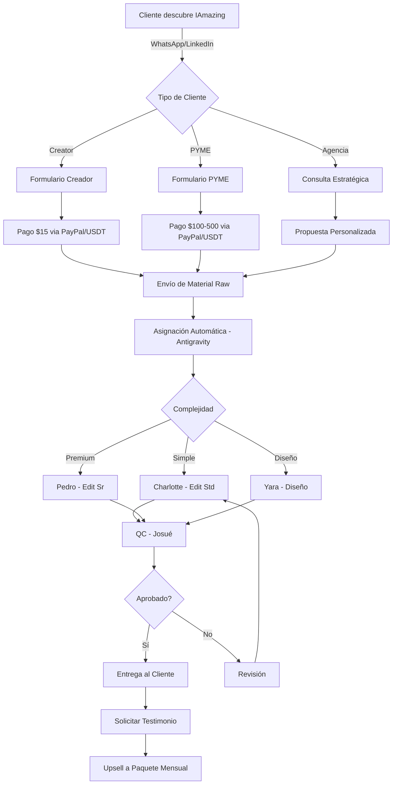
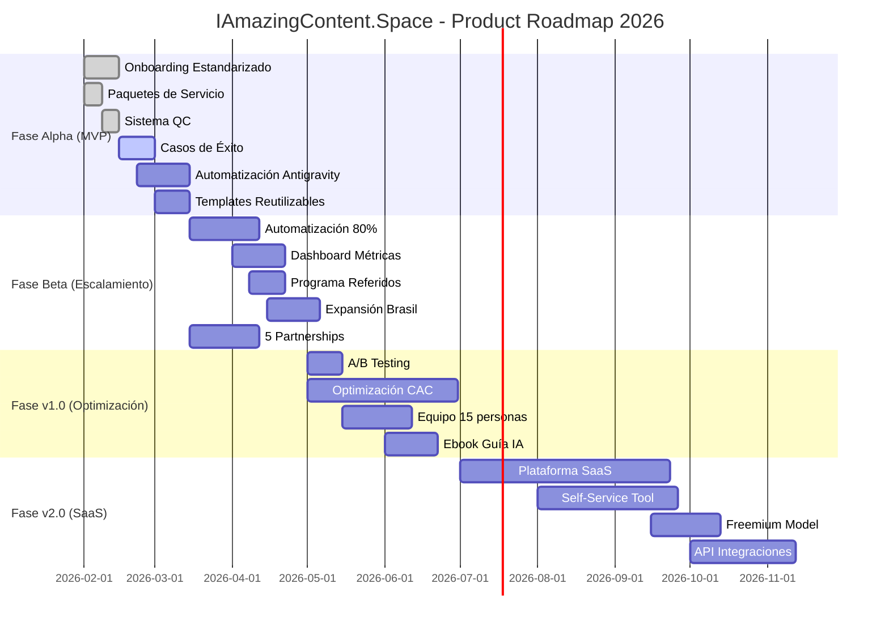

# 🗺️ PRODUCT ROADMAP
## IAmazingContent.Space - Hoja de Ruta de Producto 2026

**Proyecto:** IAmazingContent.Space  
**Período:** Febrero - Diciembre 2026 (12 meses)  
**Objetivo North Star:** Convertirse en la plataforma líder de producción de contenido IA-asistida en LATAM  

---

## 1. OBJETIVO PRINCIPAL (NORTH STAR)

**Meta 6 Meses:** $8,800 MRR con 60 clientes activos  
**Meta 12 Meses:** $25,000 MRR con 150+ clientes activos + Plataforma SaaS en beta  

**Métricas de Éxito:**
- **MRR:** $500 → $8,800 (6 meses) → $25,000 (12 meses)
- **Clientes Activos:** 7 → 60 (6 meses) → 150+ (12 meses)
- **NPS:** >90%
- **Churn Rate:** <5%
- **Brand Awareness:** 5,000 seguidores combinados (LinkedIn + Instagram)

---

## 2. DIAGNÓSTICO DE RECURSOS

### Equipo Actual (8 personas)
- **Marco:** Project Manager & Jefe I+D
- **Josué:** Coordinador de Producción
- **Bobby:** Jefe de Ventas
- **Pedro:** Editor Senior
- **Charlotte:** Editora Estándar
- **Emeve:** Editora Pasante
- **Yara:** Diseñadora Gráfica
- **Isaac:** Pasante de Ventas

### Capacidad de Ejecución
- **Actual:** 20-30 proyectos/mes
- **Mes 6:** 50-70 proyectos/mes (con automatización + 2-3 personas más)
- **Mes 12:** 100+ proyectos/mes (con plataforma SaaS + equipo de 15 personas)

### Stack Tecnológico
- **Actual:** Google Suite (Gemini, Veo, Nano Banana), Antigravity, RenderForest, Grok
- **Mes 6:** + Herramientas propias de automatización
- **Mes 12:** + Plataforma SaaS "IAmazing Studio"

---

## 3. DEFINICIÓN DE MVP (MINIMUM VIABLE PRODUCT)

### MVP v1.0 (Mes 1-2) - "Servicio Manual Optimizado"

**Must Have (Crítico):**
- [x] Proceso de onboarding estandarizado (48 horas)
- [x] 3 paquetes de servicio definidos (Creador $15, PYME $100-500, Agencia $501-2000)
- [x] Sistema de QC (Quality Control) con checklist
- [x] Pipeline de pasantes activo
- [x] 3 casos de éxito documentados

**Should Have (Importante):**
- [ ] Automatización de asignación de tareas (Antigravity Coordinator)
- [ ] Templates reutilizables (thumbnails, intros, outros)
- [ ] CRM básico (HubSpot Free)

**Could Have (Deseable):**
- [ ] Dashboard de métricas para clientes
- [ ] Programa de referidos automatizado

**Won't Have (Fuera de Alcance v1.0):**
- ❌ Plataforma SaaS
- ❌ App móvil
- ❌ Marketplace de freelancers

---

## 4. HISTORIAS DE USUARIO (USER STORIES)

### Segmento: Carlos el Creator

**US-001:** Como creator, quiero solicitar un video por WhatsApp para que sea rápido y conveniente.  
**US-002:** Como creator, quiero recibir mi video en 48 horas para mantener mi calendario de publicación.  
**US-003:** Como creator, quiero ver ejemplos de trabajos anteriores para confiar en la calidad.  
**US-004:** Como creator, quiero 1 ronda de revisiones incluida para asegurar que quede perfecto.  

### Segmento: María la PYME

**US-005:** Como dueña de PYME, quiero un paquete mensual todo incluido para no preocuparme por la producción de contenido.  
**US-006:** Como dueña de PYME, quiero un calendario de contenido planificado para tener visibilidad de lo que se publicará.  
**US-007:** Como dueña de PYME, quiero reportes mensuales de performance para medir el ROI.  
**US-008:** Como dueña de PYME, quiero soporte prioritario por WhatsApp para resolver dudas rápidamente.  

### Segmento: Alejandro el Agency Owner

**US-009:** Como dueño de agencia, quiero un servicio white-label para ofrecer video a mis clientes sin contratar editores.  
**US-010:** Como dueño de agencia, quiero un account manager dedicado para coordinar múltiples proyectos.  
**US-011:** Como dueño de agencia, quiero SLA de 24 horas para cumplir con mis clientes.  
**US-012:** Como dueño de agencia, quiero facturación mensual consolidada para simplificar mi contabilidad.  

---

## 5. FLOWCHART UX (HAPPY PATH)

### Flujo de Onboarding de Cliente

---

## 6. MAPEO DE PRIORIDADES (MOSCOW)

### Fase Alpha (Mes 1-2) - MVP

| Feature | Prioridad | Esfuerzo | Responsable | Status |
|---------|-----------|----------|-------------|--------|
| **Proceso de Onboarding Estandarizado** | Must | 2 semanas | Marco + Bobby | ✅ Completado |
| **3 Paquetes de Servicio Definidos** | Must | 1 semana | Marco + Josué | ✅ Completado |
| **Sistema de QC con Checklist** | Must | 1 semana | Josué + Pedro | ✅ Completado |
| **Pipeline de Pasantes** | Must | Continuo | Josué | 🔄 En Progreso |
| **3 Casos de Éxito Documentados** | Must | 2 semanas | Bobby + Pedro | 🔄 En Progreso |
| **Automatización Asignación (Antigravity)** | Should | 3 semanas | Marco | 📅 Planificado |
| **Templates Reutilizables** | Should | 2 semanas | Yara + Pedro | 📅 Planificado |
| **CRM Básico (HubSpot)** | Should | 1 semana | Bobby | 📅 Planificado |

### Fase Beta (Mes 3-4) - Escalamiento

| Feature | Prioridad | Esfuerzo | Responsable | Status |
|---------|-----------|----------|-------------|--------|
| **Automatización 80% de Procesos** | Must | 4 semanas | Marco | 📅 Planificado |
| **Dashboard de Métricas para Clientes** | Should | 3 semanas | Marco | 📅 Planificado |
| **Programa de Referidos Automatizado** | Should | 2 semanas | Bobby + Marco | 📅 Planificado |
| **Expansión a Brasil (Portugués)** | Should | 3 semanas | Marco + Pedro | 📅 Planificado |
| **5 Partnerships con Agencias** | Must | 4 semanas | Bobby | 📅 Planificado |
| **Tier Premium ($50-100/video)** | Could | 2 semanas | Josué + Bobby | 📅 Planificado |

### Fase v1.0 (Mes 5-6) - Optimización

| Feature | Prioridad | Esfuerzo | Responsable | Status |
|---------|-----------|----------|-------------|--------|
| **A/B Testing de Landing Pages** | Must | 2 semanas | Marco + Yara | 📅 Planificado |
| **Optimización CAC (<$120)** | Must | Continuo | Bobby + Marco | 📅 Planificado |
| **Equipo Expandido (15 personas)** | Should | 4 semanas | Josué | 📅 Planificado |
| **Alcanzar 2,000 Seguidores LinkedIn** | Should | Continuo | Pedro + Marco | 📅 Planificado |
| **Publicar Ebook "Guía IA LATAM"** | Could | 3 semanas | Marco + Josué | 📅 Planificado |

### Fase v2.0 (Mes 7-12) - Plataforma SaaS

| Feature | Prioridad | Esfuerzo | Responsable | Status |
|---------|-----------|----------|-------------|--------|
| **Plataforma SaaS "IAmazing Studio"** | Must | 12 semanas | Marco + Equipo Dev | 📅 Planificado |
| **Herramienta Self-Service para Creators** | Must | 8 semanas | Marco | 📅 Planificado |
| **Freemium Model ($0-20-50/mes)** | Must | 4 semanas | Marco + Bobby | 📅 Planificado |
| **API para Integraciones** | Should | 6 semanas | Marco | 📅 Planificado |
| **Marketplace de Freelancers** | Could | 8 semanas | Marco + Bobby | 📅 Planificado |
| **App Móvil (iOS/Android)** | Won't | - | - | ❌ Fuera de Alcance |

---

## 7. CRONOLOGÍA Y GRAFICADO (TIMELINE)

### Roadmap Visual (12 Meses)

---

## 8. CALENDARIO DE ITERACIONES (SPRINTS)

### Q1 2026 (Febrero - Abril): Fundación y Escalamiento

**Sprint 1 (Semana 1-2):** Setup Técnico
- Configurar WhatsApp Business API
- Setup Mailchimp + secuencias
- Optimizar perfiles sociales
- Crear landing pages

**Sprint 2 (Semana 3-4):** Contenido Inicial
- Producir 20 posts redes sociales
- Escribir 4 artículos blog
- Grabar 10 Reels
- Documentar 3 casos de éxito

**Sprint 3 (Semana 5-6):** Activación Canales
- Lanzar LinkedIn Ads
- Primer LinkedIn Live
- Outreach directo (100 prospects)
- Lanzar newsletter

**Sprint 4 (Semana 7-8):** Escalamiento
- Expandir a Instagram/TikTok ads
- 2 nuevos casos de éxito
- Programa de referidos
- Primer partnership agencia

### Q2 2026 (Mayo - Julio): Optimización y Expansión

**Sprint 5 (Semana 9-10):** Optimización
- A/B testing landing pages
- Automatizar 80% procesos
- Optimizar CAC
- Lanzar tier Premium

**Sprint 6 (Semana 11-12):** Expansión
- Marketing en portugués (Brasil)
- 5 partnerships activos
- 2,000 seguidores LinkedIn
- Publicar ebook

**Sprint 7 (Semana 13-14):** Consolidación
- Equipo expandido (15 personas)
- Alcanzar $8,800 MRR
- 60 clientes activos
- Planificación Fase v2.0

### Q3-Q4 2026 (Agosto - Diciembre): Plataforma SaaS

**Sprint 8-13 (Semana 15-26):** Desarrollo SaaS
- Diseño UX/UI plataforma
- Desarrollo backend/frontend
- Integración con herramientas IA
- Beta testing con 20 usuarios

**Sprint 14-17 (Semana 27-34):** Lanzamiento SaaS
- Freemium model ($0-20-50/mes)
- API para integraciones
- Marketing de lanzamiento
- Alcanzar $25,000 MRR

---

## 9. HITOS CLAVE (MILESTONES)

| Hito | Fecha Objetivo | Métrica de Éxito | Status |
|------|----------------|------------------|--------|
| **MVP Completado** | 28 Feb 2026 | 3 casos de éxito + proceso estandarizado | 🔄 En Progreso |
| **Primer Partnership** | 15 Abr 2026 | 1 agencia white-label activa | 📅 Planificado |
| **$5,000 MRR** | 30 Abr 2026 | MRR >$5,000 | 📅 Planificado |
| **Expansión Brasil** | 31 May 2026 | Marketing en portugués + 5 clientes BR | 📅 Planificado |
| **$8,800 MRR** | 30 Jun 2026 | 60 clientes activos | 📅 Planificado |
| **Equipo 15 Personas** | 31 Jul 2026 | 15 personas contratadas y onboarded | 📅 Planificado |
| **SaaS Beta** | 30 Sep 2026 | 20 usuarios beta testing | 📅 Planificado |
| **SaaS Lanzamiento** | 30 Nov 2026 | 100 usuarios SaaS + $5,000 MRR SaaS | 📅 Planificado |
| **$25,000 MRR Total** | 31 Dic 2026 | $20K servicios + $5K SaaS | 📅 Planificado |

---

## 10. ALINEACIÓN CON PRESUPUESTO

### Inversión por Fase

| Fase | Duración | Inversión Total | ROI Esperado |
|------|----------|-----------------|--------------|
| **Alpha (MVP)** | 2 meses | $320 | 6.6:1 ($2,100 MRR generado) |
| **Beta (Escalamiento)** | 2 meses | $716 | 13.8:1 ($9,900 MRR generado) |
| **v1.0 (Optimización)** | 2 meses | $1,304 | 13.5:1 ($17,600 MRR generado) |
| **v2.0 (SaaS)** | 6 meses | $15,000 | 5:1 ($75,000 MRR acumulado) |
| **TOTAL 12 MESES** | 12 meses | **$17,340** | **~14:1** |

**Nota:** Inversión v2.0 incluye desarrollo de plataforma SaaS ($10K) + marketing de lanzamiento ($5K).

---

## 11. RIESGOS Y MITIGACIÓN

| Riesgo | Probabilidad | Impacto | Mitigación |
|--------|--------------|---------|------------|
| **Retraso en Desarrollo SaaS** | Alta | Alto | Contratar dev externo, reducir scope inicial |
| **Saturación del Equipo** | Media | Alto | Automatizar más, contratar antes de saturación |
| **Competencia Agresiva** | Media | Medio | Acelerar desarrollo SaaS, fortalecer brand |
| **Cambios en Herramientas Google** | Baja | Alto | Desarrollar herramientas propias en paralelo |

---

## 12. CRITERIOS DE ÉXITO POR FASE

### Alpha (MVP) - Mes 1-2
- [x] Proceso de onboarding <48 horas
- [x] 3 casos de éxito documentados
- [ ] $1,050 MRR
- [ ] NPS >85%

### Beta (Escalamiento) - Mes 3-4
- [ ] $4,950 MRR
- [ ] 30 clientes activos
- [ ] 1 partnership activo
- [ ] CAC <$150

### v1.0 (Optimización) - Mes 5-6
- [ ] $8,800 MRR
- [ ] 60 clientes activos
- [ ] 5 partnerships activos
- [ ] CAC <$120
- [ ] Churn <5%

### v2.0 (SaaS) - Mes 7-12
- [ ] Plataforma SaaS en producción
- [ ] 100 usuarios SaaS
- [ ] $25,000 MRR total ($20K servicios + $5K SaaS)
- [ ] Equipo de 15 personas
- [ ] Valoración empresa >$1M

---

## 13. PRÓXIMOS PASOS INMEDIATOS

**Esta Semana (Semana 1):**
1. Finalizar 3 casos de éxito con clientes actuales
2. Configurar Antigravity Coordinator (asignación automática)
3. Crear biblioteca de templates (10 thumbnails, 5 intros/outros)
4. Iniciar producción de contenido marketing (20 posts, 4 artículos)

**Próximas 2 Semanas (Sprint 1):**
1. Completar setup técnico (WhatsApp, Mailchimp, Analytics)
2. Lanzar landing pages optimizadas
3. Documentar proceso de onboarding completo
4. Alcanzar primeros 10 clientes nuevos

**Próximo Mes (Sprint 1-2):**
1. Alcanzar $1,050 MRR
2. Activar primeros canales de marketing pagado
3. Establecer pipeline de pasantes robusto
4. Preparar lanzamiento de LinkedIn Live

---

*Roadmap generado por la skill `mapear-ruta-producto` siguiendo metodología Agile + Lean Startup.*
