# 🧠 BRAINSTORMING: RENOVACIÓN WEBSITE IAMAZING
## Exploración Estratégica Pre-Diseño

**Fecha:** 26 de Enero, 2026  
**Objetivo:** Definir la mejor estrategia para renovar el website usando imágenes existentes + nueva documentación  
**Método:** Cuestionamiento Socrático + Exploración de Alternativas  

---

## 1. CUESTIONAMIENTO SOCRÁTICO (PREGUNTAS PROFUNDAS)

### ¿Por qué renovar el website ahora?

**Respuesta Superficial:** "Porque tenemos nueva brand identity y documentación"

**Cuestionamiento Profundo:**
- ¿Qué problema específico del website actual está impidiendo el crecimiento?
  - **Gap #1:** Falta de diferenciación → Visitors no entienden por qué elegirnos vs competencia
  - **Gap #2:** Pricing oculto → Friction en el proceso de decisión
  - **Gap #3:** Sin social proof → Falta de confianza para contratar
  - **Gap #4:** Tono genérico → No resuena emocionalmente con buyer personas

**Insight:** No estamos renovando por estética, estamos renovando para **aumentar conversión** y **reducir CAC**.

### ¿Qué debe lograr el nuevo website que el actual no logra?

**Objetivos Medibles:**
1. **Conversión:** Aumentar de ~2% a 10% (formulario → cliente)
2. **Engagement:** Aumentar tiempo en página de 45 seg a 2 min
3. **Claridad:** Reducir bounce rate de 70% a 40%
4. **Trust:** Generar 50+ leads/mes (vs 10-15 actuales)
5. **SEO:** Posicionar en top 10 para "agencia contenido IA LATAM"

**Insight:** El website debe ser una **máquina de conversión**, no solo un brochure digital.

### ¿Cómo reutilizamos las imágenes existentes sin que se vea "reciclado"?

**Desafío:** Tenemos imágenes del website anterior (WebsiteArtwork) y logo Q'antik

**Opciones:**
- **A) Refresh Visual:** Aplicar filtros/overlays con nueva paleta (Navy + Orange)
- **B) Composición Híbrida:** Mezclar imágenes existentes con nuevos elementos generados (Nano Banana)
- **C) Recontextualización:** Usar las mismas imágenes pero con nuevo copy/messaging
- **D) Minimalismo:** Usar menos imágenes, más espacio en blanco, enfoque en copy

**Insight:** La opción **C + D** es la más lean. Las imágenes 3D futuristas del website actual son perfectas para el mensaje de IA, solo necesitan **nuevo contexto narrativo**.

---

## 2. EXPLORACIÓN DE ALTERNATIVAS (ENFOQUES DISTINTOS)

### Alternativa A: "Evolución Incremental" (Simple vs Escalable)

**Enfoque:** Mantener Google Sites, actualizar solo copy + imágenes

**Pros:**
- ✅ Rápido (1-2 días)
- ✅ Cero costo técnico
- ✅ Bajo riesgo
- ✅ Podemos iterar rápidamente

**Contras:**
- ❌ Limitaciones de Google Sites (no custom CSS completo)
- ❌ No podemos implementar design tokens 100%
- ❌ Difícil agregar interactividad (calculadora ROI, etc.)
- ❌ Menos control sobre SEO

**Cuándo Elegir:** Si necesitamos lanzar en <1 semana y tenemos presupuesto $0

### Alternativa B: "Revolución Total" (Escalable pero Complejo)

**Enfoque:** Website custom desde cero (HTML + CSS + JS) en Netlify

**Pros:**
- ✅ Control total de design tokens
- ✅ Optimización SEO completa
- ✅ Interactividad avanzada (calculadoras, animaciones)
- ✅ Lighthouse score >90 posible
- ✅ Escalable a largo plazo

**Contras:**
- ❌ Tiempo de desarrollo (2-3 semanas)
- ❌ Requiere skills de desarrollo
- ❌ Mayor complejidad de mantenimiento
- ❌ Riesgo de over-engineering

**Cuándo Elegir:** Si tenemos 3-4 semanas y queremos la solución definitiva

### Alternativa C: "Híbrido Pragmático" (RECOMENDADO)

**Enfoque:** Actualizar Google Sites ahora + Desarrollar custom en paralelo

**Fase 1 (Semana 1):** Quick Wins en Google Sites
- Reescribir homepage hero
- Agregar pricing transparente
- Agregar 3 testimonios
- Integrar botón WhatsApp
- Actualizar imágenes con overlays Navy + Orange

**Fase 2 (Semana 2-4):** Desarrollar website custom
- HTML + Vanilla CSS con design tokens
- Implementar calculadora ROI
- Blog "IA Content Lab" integrado
- Newsletter signup
- Casos de éxito interactivos

**Fase 3 (Semana 5):** Migración y Launch
- Migrar de Google Sites a Netlify
- Configurar dominio custom
- Setup analytics + tracking
- A/B testing de variantes

**Pros:**
- ✅ Resultados inmediatos (Fase 1)
- ✅ Solución definitiva a mediano plazo (Fase 2-3)
- ✅ Bajo riesgo (si Fase 2 falla, Fase 1 ya está live)
- ✅ Aprendizaje iterativo

**Contras:**
- 🟡 Trabajo duplicado (actualizar Google Sites + desarrollar custom)
- 🟡 Requiere disciplina para no abandonar Fase 2

**Cuándo Elegir:** Cuando queremos balance entre velocidad y calidad (NUESTRO CASO)

---

## 3. ANÁLISIS DE RIESGOS (ABOGADO DEL DIABLO)

### ¿Por qué podría FALLAR la renovación del website?

**Riesgo #1: Perfeccionismo Paralizante**
- **Síntoma:** Pasamos 3 semanas diseñando y nunca lanzamos
- **Mitigación:** Deadline estricto de 1 semana para Fase 1 (Google Sites)
- **Regla:** "Done is better than perfect"

**Riesgo #2: Desalineación con Realidad del Negocio**
- **Síntoma:** Website promete "entrega en 24h" pero equipo solo puede hacer 48-72h
- **Mitigación:** Validar TODAS las promesas del website con Josué (Coord. Producción)
- **Regla:** "Under-promise, over-deliver"

**Riesgo #3: Sobre-Ingeniería Técnica**
- **Síntoma:** Agregamos features complejas que nadie usa (chatbot IA, 3D interactivo)
- **Mitigación:** MVP primero, features avanzadas después
- **Regla:** "YAGNI - You Aren't Gonna Need It"

**Riesgo #4: Falta de Medición**
- **Síntoma:** Lanzamos nuevo website pero no sabemos si convierte mejor
- **Mitigación:** Setup Google Analytics + Facebook Pixel ANTES de lanzar
- **Regla:** "What gets measured gets managed"

**Riesgo #5: Copy Genérico**
- **Síntoma:** Usamos frases cliché ("Transformamos tu negocio", "Soluciones innovadoras")
- **Mitigación:** Usar voice & tone guide estricto + ejemplos específicos
- **Regla:** "Show, don't tell" (métricas reales, no promesas vagas)

---

## 4. DECISIONES CRÍTICAS (CONSENSO NECESARIO)

### Decisión #1: ¿Google Sites o Custom Website?

**Recomendación:** **Híbrido** (Google Sites ahora + Custom en 3-4 semanas)

**Justificación:**
- Necesitamos resultados inmediatos (leads, conversión)
- Google Sites permite iterar rápido sin código
- Custom website es inversión a mediano plazo
- Podemos A/B test ambas versiones

**Pregunta al Usuario:** ¿Tienes 3-4 semanas para desarrollar custom o necesitas resultados en <1 semana?

### Decisión #2: ¿Cuántas páginas debe tener el nuevo website?

**Opción A: Minimalista (3 páginas)**
- Homepage (con secciones: Hero, Servicios, Casos, Equipo, Contacto)
- Blog
- Política de Privacidad

**Opción B: Estándar (6 páginas)** ← RECOMENDADO
- Homepage
- Servicios (con pricing transparente)
- Casos de Éxito
- Equipo
- Blog / Recursos
- Contacto

**Opción C: Completo (10+ páginas)**
- Homepage
- Servicios
- Pricing
- Casos de Éxito
- Equipo
- Sobre Nosotros
- Blog
- Recursos / Guías
- FAQ
- Contacto

**Recomendación:** **Opción B** (6 páginas) para MVP

**Pregunta al Usuario:** ¿Prefieres minimalista (3) o estándar (6)?

### Decisión #3: ¿Qué imágenes reutilizamos del website actual?

**Inventario de Imágenes Existentes:**
- WebsiteArtwork: 50+ imágenes 3D futuristas (cilindros, grids, formas geométricas)
- Logo Q'antik: 8 variaciones (isotipo, isologo, negativo)
- Imagen promocional: Amarillo + Negro (Automatización YouTube)

**Estrategia de Reutilización:**

**Reutilizar SÍ:**
- ✅ Imágenes 3D futuristas (perfectas para mensaje de IA)
- ✅ Grids/patterns geométricos (como backgrounds sutiles)
- ✅ Elementos abstractos (para secciones de servicios)

**Reutilizar CON MODIFICACIÓN:**
- 🟡 Logo Q'antik → Inspiración para nuevo logo IAmazing (mantener geometría de esfera)
- 🟡 Imagen promocional → Replicar estilo pero con nueva paleta (Navy + Orange)

**NO Reutilizar:**
- ❌ Logo Q'antik tal cual (es de otra marca)
- ❌ Imágenes con branding viejo visible

**Pregunta al Usuario:** ¿Quieres que generemos nuevo logo IAmazing o adaptamos Q'antik?

### Decisión #4: ¿Qué nivel de interactividad necesitamos?

**Nivel 1: Estático** (Solo HTML + CSS)
- Texto, imágenes, links
- Sin JavaScript
- Rápido, simple, SEO-friendly

**Nivel 2: Interactivo Básico** (HTML + CSS + JS básico) ← RECOMENDADO
- Smooth scroll
- Acordeones (FAQ)
- Formularios con validación
- Botón WhatsApp flotante
- Animaciones sutiles (fade-in)

**Nivel 3: Interactivo Avanzado** (HTML + CSS + JS complejo)
- Calculadora ROI interactiva
- Filtros de portafolio
- Chatbot IA
- Animaciones 3D (Three.js)

**Recomendación:** **Nivel 2** para MVP (interactividad básica)

**Pregunta al Usuario:** ¿Necesitas calculadora ROI o chatbot desde el inicio?

---

## 5. PROPUESTA DE ARQUITECTURA (DIAGRAMA DE DECISIÓN)

### Estructura de Información Propuesta

```mermaid
graph TD
    A[Homepage] --> B[Hero: IA que Entiende LATAM]
    A --> C[Problema/Solución]
    A --> D[Servicios: 3 Paquetes]
    A --> E[Casos de Éxito: 3 Testimonios]
    A --> F[Equipo: 8 Personas]
    A --> G[CTA: Agenda Consulta]
    
    H[Servicios] --> I[Creador $15]
    H --> J[PYME $100-500]
    H --> K[Agencia $501-2000]
    H --> L[Comparación de Paquetes]
    
    M[Casos de Éxito] --> N[Carlos: Creator]
    M --> O[María: PYME]
    M --> P[Alejandro: Agency]
    
    Q[Equipo] --> R[Storytelling del Equipo]
    Q --> S[8 Bios con Fotos]
    Q --> T[Por Qué Nosotros]
    
    U[Blog] --> V[IA Content Lab]
    U --> W[5 Artículos Iniciales]
    U --> X[Newsletter Signup]
    
    Y[Contacto] --> Z[WhatsApp Principal]
    Y --> AA[Formulario Backup]
    Y --> AB[Calendario Booking]
```



### User Journey Optimizado

```
Visitor → Homepage Hero (10 seg)
  ↓
  ¿Resuena el mensaje "IA que entiende LATAM"?
  ↓ SÍ
  Scroll a Servicios (20 seg)
  ↓
  ¿Ve su paquete (Creador/PYME/Agencia)?
  ↓ SÍ
  Scroll a Casos de Éxito (30 seg)
  ↓
  ¿Se identifica con testimonio?
  ↓ SÍ
  Click en CTA "Agenda Consulta" (45 seg)
  ↓
  WhatsApp → Conversación → Cliente
```

**Objetivo:** Convertir en <60 segundos

---

## 6. CONSENSO Y DIRECCIÓN CLARA

### Decisiones Tomadas (Para Validar con Usuario)

1. **Enfoque:** Híbrido (Google Sites ahora + Custom en 3-4 semanas)
2. **Páginas:** 6 páginas estándar (Homepage, Servicios, Casos, Equipo, Blog, Contacto)
3. **Imágenes:** Reutilizar 3D futuristas del website actual con overlays Navy + Orange
4. **Interactividad:** Nivel 2 (básico) - Smooth scroll, formularios, WhatsApp flotante
5. **Prioridad #1:** Conversión sobre estética
6. **Deadline Fase 1:** 1 semana (Google Sites actualizado)

### Preguntas Pendientes para el Usuario

1. ¿Tienes 3-4 semanas para custom website o necesitas resultados en <1 semana?
2. ¿Generamos nuevo logo IAmazing o adaptamos Q'antik?
3. ¿Necesitas calculadora ROI o chatbot desde el inicio?
4. ¿Quién del equipo puede proveer fotos para la página de Equipo?
5. ¿Tienes acceso a testimonios reales de clientes actuales?

### Próximos Pasos (Post-Brainstorming)

1. **Validar decisiones** con usuario
2. **Activar skill `diseñar-solucion-digital`** para crear wireframes + copy
3. **Generar assets visuales** (logo, iconos, overlays para imágenes)
4. **Desarrollar Fase 1** (Google Sites actualizado)
5. **Planificar Fase 2** (Custom website)

---

## 7. PRINCIPIOS GUÍA (OCCAM'S RAZOR)

**Simplicidad > Complejidad**
- Si podemos lograr el objetivo con menos código, mejor
- Si podemos lograr el objetivo con menos páginas, mejor
- Si podemos lograr el objetivo con menos imágenes, mejor

**Velocidad > Perfección**
- Lanzar en 1 semana con 80% de calidad > Lanzar en 1 mes con 100%
- Iterar basado en feedback real > Adivinar qué quiere el usuario

**Conversión > Estética**
- Un website "feo" que convierte al 10% > Un website "hermoso" que convierte al 2%
- Métricas > Opiniones

**Datos > Intuición**
- Setup analytics desde día 1
- A/B test todo lo que sea crítico (hero copy, CTA buttons, pricing display)

---

*Brainstorming completado usando skill `realizar-brainstorming` - Listo para diseñar solución digital*
